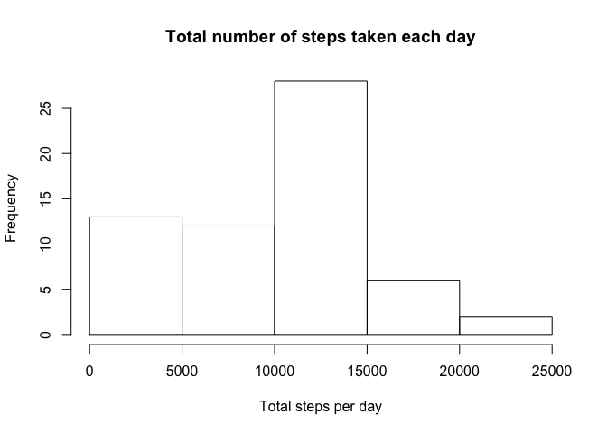
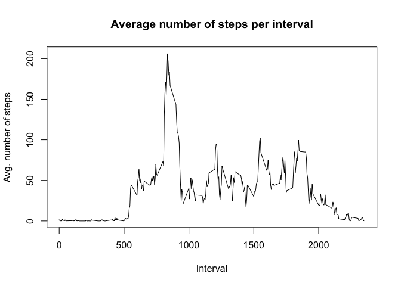
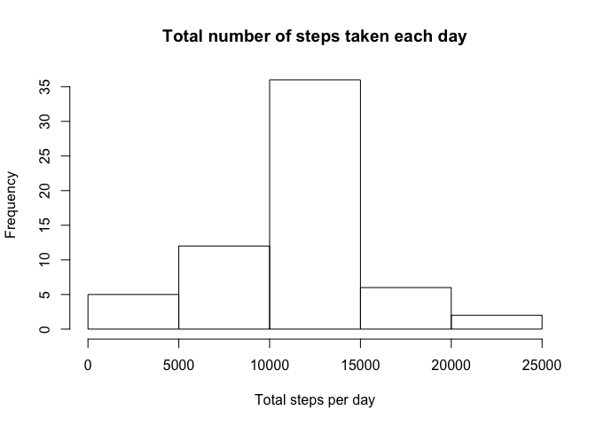
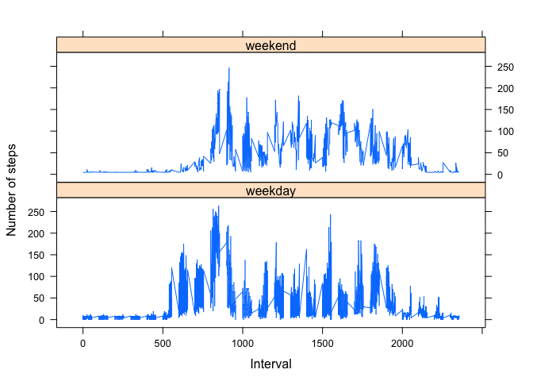

## Loading and preprocessing the data

```r
#Checks if file exists and download the file:
zipUrl <- "https://d396qusza40orc.cloudfront.net/repdata%2Fdata%2Factivity.zip"
zipFile <- "activity.zip"
if(!file.exists(zipFile)) {
download.file(fileUrl, zipFile, method="curl")
}

#Unzips file:
if (!file.exists("activity")) { 
    unzip(zipFile) 
}

#Read file
activity <- read.csv("activity.csv", header = TRUE, sep = ",", na.strings = "NA")

#Process data
activity$date <- as.POSIXct(activity$date, format = "%Y-%m-%d")
```

```
## Warning in strptime(x, format, tz = tz): unknown timezone 'zone/tz/2018c.
## 1.0/zoneinfo/America/Chicago'
```

```r
activity_data <- data.frame(activity)
```


## What is mean total number of steps taken per day?

```r
#Number of steps per day
steps_per_day <- aggregate(activity_data$steps, by = list(activity_data$date), FUN = sum, na.rm = TRUE)

hist(steps_per_day$x, main = "Total number of steps taken each day", xlab = "Total steps per day")
```

<!-- -->

```r
#Mean of the total number of steps taken per day
mean(steps_per_day$x)
```

```
## [1] 9354.23
```

```r
#Median of the total number of steps taken per day
median(steps_per_day$x)
```

```
## [1] 10395
```

## What is the average daily activity pattern?

```r
#Average number of steps per interval
steps_per_interval <- aggregate(activity_data$steps, by = list(activity_data$interval), FUN = mean, na.rm = TRUE)

#Plot of average number of steps per interval
plot(steps_per_interval$Group.1, steps_per_interval$x, type = "l",
     main = "Average number of steps per interval", 
     xlab = "Interval", ylab = "Avg. number of steps")
```

<!-- -->

```r
#Find interval with maximum number of steps
position <- which(steps_per_interval$x == max(steps_per_interval$x))

steps_per_interval[position, 1]
```

```
## [1] 835
```


## Imputing missing values

```r
#Sum of missing values
sum(is.na(activity_data$steps))
```

```
## [1] 2304
```

```r
#Replace missing values with mean of the day

na_position <- which(is.na(activity_data$steps))

missing_mean <- rep(mean(activity_data$steps, na.rm = TRUE), times = length(na_position))

#Create new dataset
activity_data[na_position, "steps"] <- missing_mean      

#Histogram of the total number of steps taken each day
steps_per_day <- aggregate(activity_data$steps, by = list(activity_data$date), FUN = sum)

hist(steps_per_day$x, main = "Total number of steps taken each day", xlab = "Total steps per day")
```

<!-- -->

```r
#Mean of the total number of steps taken per day
mean(steps_per_day$x)
```

```
## [1] 10766.19
```

```r
#Median of the total number of steps taken per day
median(steps_per_day$x)
```

```
## [1] 10766.19
```
## Are there differences in activity patterns between weekdays and weekends?

```r
library(lattice)

#Weekday and weekend variables
activity_data$dayofweek <- weekdays(activity_data$date)

activity_data$daytype <- ifelse(activity_data$dayofweek == "Saturday" | 
                   activity_data$dayofweek == "Sunday", "weekend", "weekday")

steps_per_weekday <- aggregate(activity_data$steps, by = list(activity_data$daytype,
                                                              activity_data$dayofweek,
                                                              activity_data$interval), FUN = mean)

names(steps_per_weekday) <- c("daytype", "weekday", "interval", "mean")

xyplot(mean ~ interval | daytype, steps_per_weekday, 
       type="l", 
       lwd=1, 
       xlab="Interval", 
       ylab="Number of steps", 
       layout=c(1,2))
```

<!-- -->

